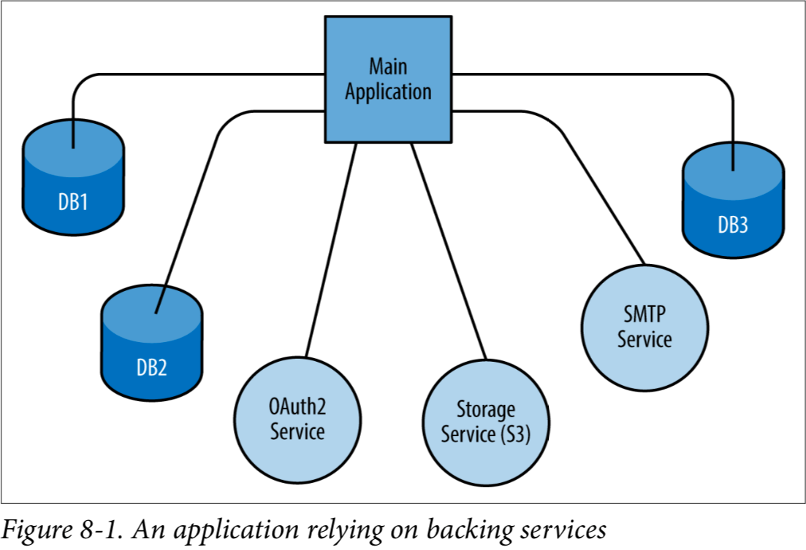

# 
CHAPTER 8

### Backing Services

因素4的意思是你需要把后端服务当作绑定的资源

上面说的听起来确实是个好的建议，但是为了能够正确的理解这个建议，我们需要去了解到底什么是后端资源以及什么是绑定的资源

后端服务是一个你需要依赖它的功能的应用程序，这是一个相当宽泛的定义，而且是有意定义的这么的宽泛的。其中一些常见的后端服务包括数据存储，消息中心，缓存系统，以及很多其他类型的服务比如说提供业务功能的服务或者加密服务

当你在构建一个云原生的应用的适合，你必须把文件系统也当作瞬时的，你必须把文件存储或者磁盘都当作后端服务，你不能像常规的企业应用一样去从磁盘读取或者写入文件。相反，文件存储应该被当作你应用程序的一个必然存在的资源来考虑

图 8-1 阐明了一个应用，以及一系列的后端服务，和这些服务绑定的资源（连接线）。而且，注意这些文件存储是抽象的（eg,Amazon S3），并不是直接系统级别访问的磁盘

一个绑定的资源是指把你的应用连接到后端服务，一个绑定到数据库的资源可能需要一个用户名，一个密码，以及一个URI，有了这些你的应用就能消费后端服务了

本书的前面就提到过，我们需要外化配置（与代码和证书隔离开来）以及我们释放的产品应该是不可变的。把这些规则与一个应用消费后端服务结合起来，我们得到了一些资源绑定的规则：
*一个应用需要声明它需要的后端服务，但是必须允许云平台去实施资源绑定
*应用与后端服务的绑定应该是通过外化的配置来完成的
*如果一个应用想的话，它可以随时在不需要重新部署的前提下去依附或者分离后端服务

举个例子，假设你的应用需要去连接一个Oracle数据库，你在编码的时候可以先假设你已经拥有了一个可以信赖的Oracle数据库（与特定的语言或者工具集相关），程序源代码假设只要配置好了，就能将外部的资源绑定到应用

这意味着你的应用程序没有一行代码会与某个特定的服务耦合到一起，同样的，你可能会有一个用来发送邮件的后端服务，所以你知道你需要通过SMTP连接到邮件服务。但是邮件服务的准确的实现细节从来不会影响到你的应用，同时你的应用也不会依赖于某个固定位置的SMTP服务器，也不需要依赖特定的证书

最终，当你开发的时候把后端服务当作绑定的资源这样考虑的时候，其中一个最大的好处是你可以随时依附和分离资源

>断路器
一些工具包提供断路器允许你的程序在后端服务出现问题的时候与它们端来连接，并且提供了降级的方式。由于断路器位于你的应用和后端服务中间，所以你必须首先拥抱后端服务，你才能利用断路器的优势

一个已经拥抱了后端服务的应用有选择的机会，一个管理员注意到了一个数据库实例已经死了，他可以再启动一个新的数据库实例，然后把你的应用绑定到新的数据库实例

这种与后端服务的灵活性，弹性以及松耦合组成了云原声应用真正现代化的标志
